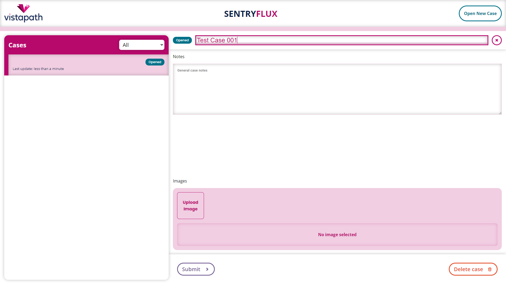

# VistaPath - Medical Lab Workflow System

## Requirements

* [Node.js/npm](https://nodejs.org)
* A desktop browser of your choice

## Usage

To start the app, simply run the following two command in your terminal of choice:

```bash
$ npm install
$ npm start
```

This will start the development server at http://localhost:3000

### Opening a new Case

Use the Open New Case button to open a new case


### Naming a Case

When you create a new case, you will be automatically prompted to name it. Just start typing and then press enter!




### Adding notes to a Case

You can add generic text notes to a case. It saves automatically after you're done typing!


### Adding and annotating images

You can add images by clicking the "Upload Image" button in the Case Detail pane. Once you've uploaded an image:

* Click on the thumbnail to preview it at a larger size
* Click on the preview to annotate it


### Changing the status of a Case

You can update the status of a case using the buttons in the footer of the Case Detail pane (the Submit button can be seen in purple in the below screenshot)


### Approving, Reject, Deleting, and Closing

Once a case is created and submitted, it can be Approved or Rejected

* If Approved, that's it! You're done.
* If Rejected, you can Update it with more notes and images


## Goal

Design a visually appealing and user-friendly medical lab workflow system.

## Description

The system shall provide a user interface, whereby a user can:

* initiate a case analysis workflow by creating a new case
* upload images
* annotate uploaded images
* provide general notes about the case

Cases must proceed through 3-5 statuses:

* Opened
* Submitted
* Updated
* Approved
* Rejected

The user interface should provide a way to:

* view all currently created cases
* filter them by their status
* view and edit case details

## Flows

### Primary

```
Opened -> Submitted -> Approved
```

### Optional

```
Opened -> Submitted -> Rejected -> Updated -> Approved
```

## Status Descriptions and Logic

### Opened

* Cases start in the Opened status.
* Cases in the Opened status can be moved to the Submitted status.

### Submitted

* Cases in the Submitted status can be moved to the Approved or Rejected statuses

### Updated

* Cases in the Updated status can be moved to the Approved or Rejected statuses

### Approved

* Cases in the Approved status cannot have their details edited

### Rejected

* Cases in the Rejected status can be moved to the Updated status
